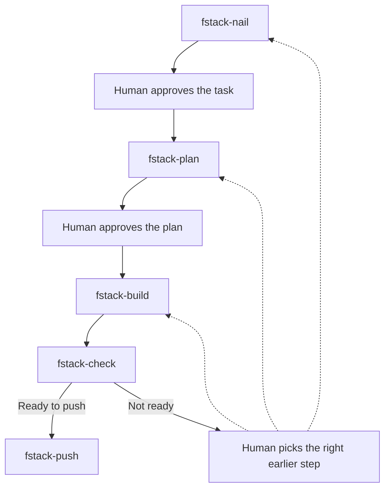
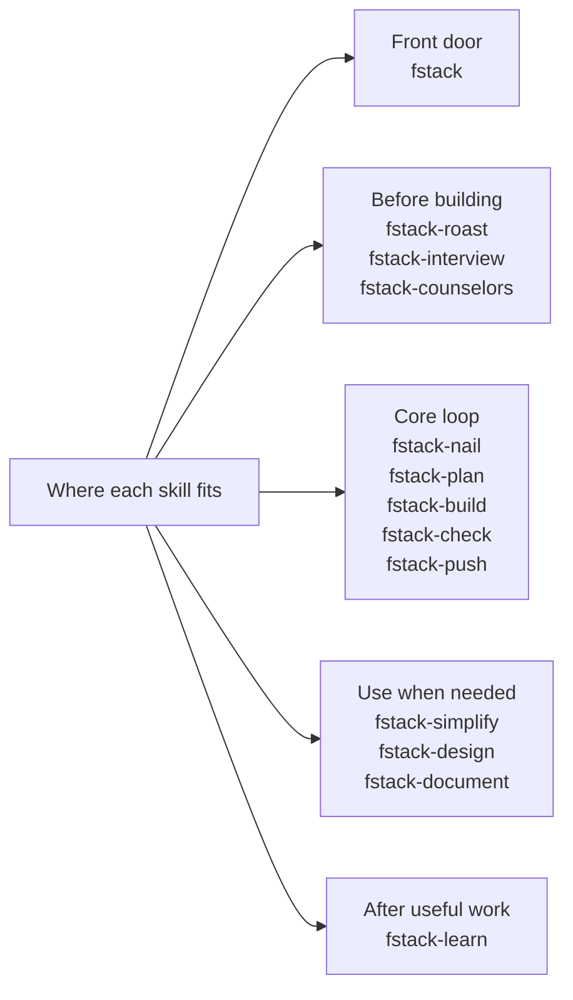

# fstack — the simple stack

Agent skills that ask: can this be less?

## The problem

Skill collections keep growing. 30 skills, personas, pipelines, voice triggers. You can't hold that in your head, so you stop using it.

And the complexity doesn't stay in the workflow. A process built to sound smart — phases, personas, ceremony — produces code that sounds smart too: layers, abstractions, and options nobody asked for.

## The idea

fstack is 13 skills. Plain names, one job each.

The agent works in small steps and checks in with you. You approve; it executes. No long autonomous runs.

One skill — `/fstack-simplify` — exists only to remove things. No other stack has that.

## Install

```bash
npx skills@latest add flaviocopes/fstack
```

That's it. No dependencies, no build step, no config.

## The core loop



You invoke each skill and decide when to move on.

Before the loop:

- `/fstack-roast` — when you have a product idea and want honest pushback before writing code
- `/fstack-interview` — when the agent should know the business behind the project; it asks, you answer, the answers land in AGENTS.md

Sprinkle in anywhere:

- `/fstack-simplify` — when something feels bloated, from one file to the whole codebase
- `/fstack-design` — when UI looks off or inconsistent with the rest
- `/fstack-document` — when the project needs docs, or the docs have gone stale
- `/fstack-learn` — when something is worth remembering
- `/fstack-counselors` — when a decision is big enough to want three independent model opinions

Don't know where to start? `/fstack` is the front door. Describe what you want and it picks the right skill.



## The 13 skills

| Skill | What it does |
|---|---|
| `/fstack` | The front door. Picks the right skill for your request. |
| `/fstack-roast` | Stress-tests a product idea. Ends with a verdict and the smallest version worth building. |
| `/fstack-interview` | Interviews you about the product — demand, customer, pricing, risks — and records the answers in AGENTS.md. |
| `/fstack-counselors` | Asks the 3 most capable models the same question, independently, and synthesizes one verdict plus each opinion. |
| `/fstack-nail` | Asks up to 5 questions, nails down a 3-line summary, gets your yes before any work starts. |
| `/fstack-plan` | Writes a one-page plan with a mandatory "what we're NOT doing" section. |
| `/fstack-build` | Implements the plan one small step at a time, asking at real choices. |
| `/fstack-simplify` | Audits for unnecessary complexity and proposes deletions — one file or the whole codebase. Only deletions. |
| `/fstack-design` | Makes UI adhere to the project's existing styles and cleans up design slop. |
| `/fstack-document` | Writes docs/ for the project, ELI5 to deep. Run again to update them with changes. |
| `/fstack-check` | Three questions: does it work, does it match the plan, is it simple. |
| `/fstack-learn` | Captures one lesson in three lines, so future sessions start smarter. |
| `/fstack-push` | Commits any uncommitted work and pushes to the remote. Nothing else — no tests, no deploy. |

## Philosophy

1. Short sentences. One idea per sentence.
2. Short paragraphs, then a blank line.
3. No jargon. If a plumber wouldn't understand the word, find a simpler one.
4. No personas. Skills describe steps, not characters.
5. One job per skill.
6. Prefer deletion. When something can be shorter, make it shorter.
7. Every skill fits in ~150 lines. If it doesn't, it's doing too much.
8. The human drives. Skills pause at decision points and ask.
9. Agent-agnostic. Plain markdown, no hardcoded tool names.
10. Plain-English tone. Like explaining to a friend.

## Credits

fstack exists because of the stacks it distills. [gstack](https://github.com/garrytan/gstack) by Garry Tan gave it the full lifecycle idea and, through office hours, the idea-roasting step. [pstack](https://cursor.com/marketplace/cursor/pstack) by Lauren Tan gave it design-before-code and blast-radius thinking. [Compound Engineering](https://github.com/EveryInc/compound-engineering-plugin) by Every gave it the plan artifact and the lesson-capture step. [Matt Pocock's skills](https://github.com/mattpocock/skills) gave it grilling, the two-axis review, and the small-skills shape. [counselors](https://github.com/aarondfrancis/fstack-counselors) by Aaron Francis gave it the council-of-advisors pattern behind `/fstack-counselors`. Go look at all of them — they're generous, thoughtful work.

## License

MIT
